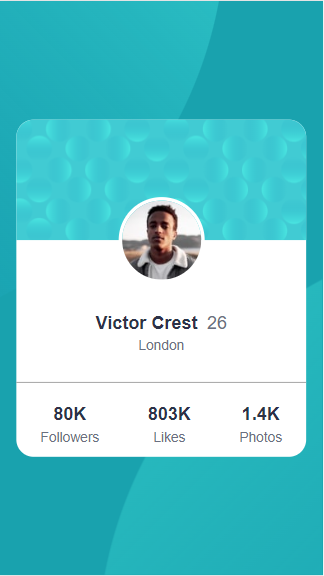
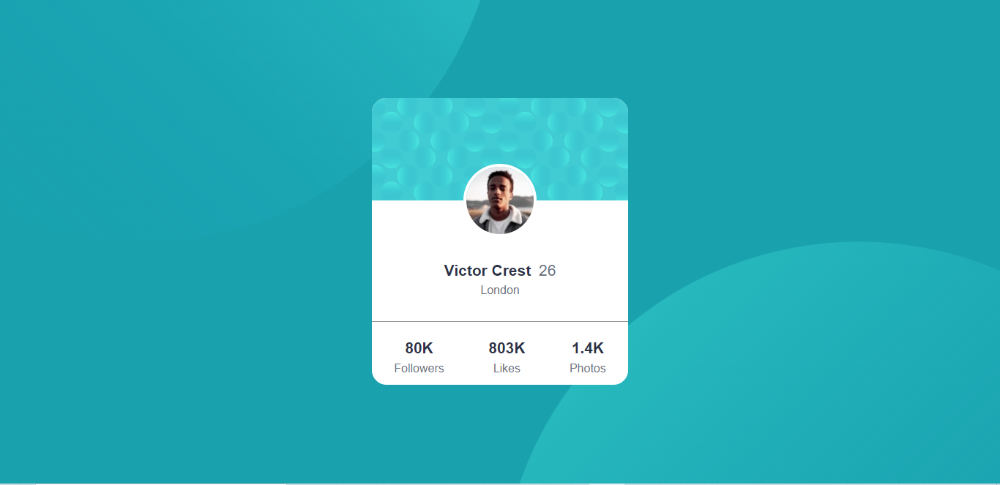

# Frontend Mentor - Profile card component solution

This is a solution to the [Profile card component challenge on Frontend Mentor](https://www.frontendmentor.io/challenges/profile-card-component-cfArpWshJ). Frontend Mentor challenges help you improve your coding skills by building realistic projects. 

## Table of contents

- [Overview](#overview)
  - [The challenge](#the-challenge)
  - [Screenshot](#screenshot)
  - [Links](#links)
- [My process](#my-process)
  - [Built with](#built-with)
- [Author](#author)
- [Acknowledgments](#acknowledgments)

## Overview

### The challenge

- Build out the project to the designs provided

### Screenshot

> #### Mobile Screenshot

  

  #### Desktop Screenshot

  

### Links

- Solution URL: [GitHub Repo](https://github.com/davidBen-Adeji/F.M-profile_card)
- Live Site URL: [Live Site](https://moonlit-jalebi-70854c.netlify.app/)

## My process

### Built with

- Semantic HTML5 markup
- Flexbox
- Mobile-first workflow

## Author

- Frontend Mentor - [@davidBen-Adeji](https://www.frontendmentor.io/profile/davidBen-Adeji)

## Acknowledgments

Thank you [Rustcode](https://www.youtube.com/c/Rustcode). Your video helped me figure out how to position the profile image :)
